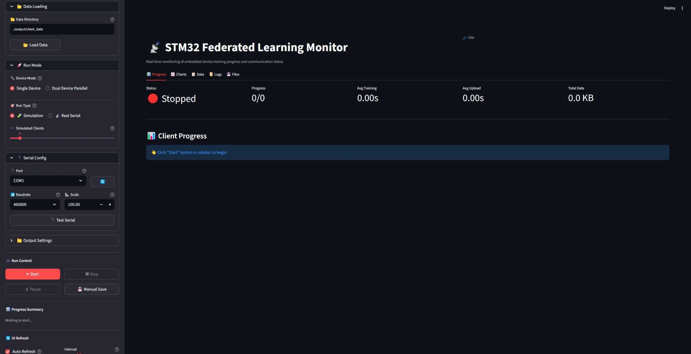

# Analytical Federated Learning for Scalable NILM

[](LICENSE)
[](https://www.python.org/)
[](#)

This repository contains the **supplementary materials** for **"An Analytical Federated Learning Framework for Scalable Non-Intrusive Load Monitoring"**.

Our framework solves the global-local bias issue in existing gradient-based federated methods, achieving efficient and scalable non-intrusive load monitoring with performance equivalent to centralized learning.

---

## ⚠️ Code Availability Statement

**Status**: This repository currently contains **supplementary materials** only.

The core implementation of the proposed analytical federated learning framework, including:
- Analytical local update algorithms
- Pre-trained shared feature extractor models
- STM32 embedded firmware implementation

**These components are currently withheld during the peer review process** and will be **publicly released upon paper acceptance**, in accordance with standard academic publishing practices. This ensures the protection of intellectual property while maintaining reproducibility commitments.

### Currently Available Supplementary Materials

✅ **STM32 Monitoring Platform** ([`stm32_deployment/stm32_monitoring_platform/`](stm32_deployment/stm32_monitoring_platform/))  
   Web-based coordination interface for hardware federated learning experiments

✅ **Demo Video & Screenshots** ([`stm32_deployment/assets/`](stm32_deployment/assets/))  
   Complete hardware deployment demonstration (dual-device setup and training)

✅ **Data Simulation Parameters** ([`data_simulation/`](data_simulation/))  
   Circuit topologies, electrical parameters, and configurations for synthetic load generation

---

## 📋 Repository Structure (Current Release)

```
An-Analytical-Federated-Learning-Method-for-Scalable-NILM/
├── stm32_deployment/
│   ├── stm32_monitoring_platform/  # ✅ Web-based FL coordination platform
│   └── assets/                     # ✅ Demo videos and screenshots
├── data_simulation/                # ✅ Simulation parameters & load topologies
│   ├── simulation_load_parameters.pdf
│   ├── simulation_load_parameters.xlsx
│   └── assets/                     # Circuit topology diagrams
├── LICENSE
└── README.md
```

**Legend**: ✅ = Currently available | The checkmark indicates supplementary materials provided during review phase.

**Note**: Core algorithm implementations (analytical FL framework, pre-trained models, and STM32 firmware) will be added to this repository upon paper acceptance.

## 🚀 Current Release (Pre-Acceptance)

The following components are **currently available**:

### 1. STM32 Monitoring Platform ✅
- **Location**: [`stm32_deployment/stm32_monitoring_platform/`](stm32_deployment/stm32_monitoring_platform/)
- **Description**: Web-based platform for coordinating and monitoring federated learning across multiple STM32 edge devices
- **Features**:
  - Real-time training progress visualization
  - Dual-device parallel coordination
  - Simulation mode (no hardware required)
  - Bilingual interface (Chinese/English)
- **Documentation**: See [Platform README](stm32_deployment/stm32_monitoring_platform/readme.md)

**Platform Screenshot:**


*Real-time monitoring interface showing dual-device federated learning progress*

### 2. Demo Video ✅
- **Location**: [`stm32_deployment/assets/`](stm32_deployment/assets/)
- **Content**: Complete hardware deployment demonstration showing dual-device federated learning

**Watch Demo:**

https://github.com/2771618309/An-Analytical-Federated-Learning-Method-for-Scalable-NILM/assets/stm32_deployment_demo.mp4

*Video demonstrates: hardware setup, platform configuration, dual-device parallel training, and real-time results*

> **Note**: Video file is 195MB. Download from [assets folder](stm32_deployment/assets/stm32_deployment_demo.mp4).

### 3. Data Simulation Parameters ✅
- **Location**: [`data_simulation/`](data_simulation/)
- **Description**: Comprehensive simulation parameters and topology configurations for generating synthetic load data
- **Contents**:
- `simulation_load_parameters.pdf` - Electrical parameters and simulation configurations for various load types
- `simulation_load_parameters.xlsx` - Editable parameter tables
  - `assets/` - Circuit topology diagrams and configuration illustrations
- **Documentation**: See [Data Simulation README](data_simulation/README.md)

**Simulated Load Topologies:**


## ⏳ Full Code Release Plan

Upon paper acceptance, this repository will be updated with the following components:

### 1. **Analytical Federated Learning Framework**
- Closed-form solution for local updates
- Gram matrix computation algorithms
- Cloud-side aggregation procedures

### 2. **Pre-trained Shared Feature Extractor**
- Model architecture and weights
- Training scripts

### 3. **STM32 Embedded Firmware** 
- C implementation optimized for embedded systems
- Memory-efficient matrix operations
- Binary communication protocol
- Complete build and deployment guides

**Timeline**: Full code release will occur immediately upon paper acceptance notification.

**Star this repository** ⭐ to receive notifications when the complete implementation is released!

## 📄 Citation

If you use this work in your research, please cite:

```bibtex
@article{guo2026analytical,
  title={An Analytical Federated Learning Framework for Scalable Non-Intrusive Load Monitoring},
  author={Wenlong Guo, Qingquan Luo, Tao Yu, Xiaolei Hu, Yufeng Wu, and Zhenning Pan},
  journal={Under Review},
  year={2026}
}
```

**Note**: Citation will be updated with journal information after paper acceptance.

## 🎯 Quick Start

### For Platform Users (Available Now)

1. **Navigate to the monitoring platform**:
   ```bash
   cd stm32_deployment/stm32_monitoring_platform
   ```

2. **Install dependencies**:
   ```bash
   pip install -r requirements.txt
   ```

3. **Launch the platform**:
   - **Windows**: Double-click `open_platform .bat`


4. **Try simulation mode** (no hardware needed):
   - Select "Simulation Test" in the platform interface
   - Configure virtual clients and start training

See [Platform Documentation](stm32_deployment/stm32_monitoring_platform/readme.md) for detailed usage instructions.

## 📧 Contact

- **Repository**: [GitHub - Analytical Federated Learning for Scalable NILM](https://github.com/2771618309/An-Analytical-Federated-Learning-Method-for-Scalable-NILM)
- **Issues**: For technical questions about the available supplementary materials, please open an [issue](https://github.com/2771618309/An-Analytical-Federated-Learning-Method-for-Scalable-NILM/issues)
- **Email**: 2771618309@qq.com

**Note**: We cannot provide early access to unreleased code components during the peer review period. Thank you for your understanding.

## 📜 License

This project is licensed under the MIT License - see the [LICENSE](LICENSE) file for details.

---

**Repository Status**: Supplementary Materials (Pre-Acceptance)  
**Last Updated**: February 2026  
**Full Release**: Upon paper acceptance

⭐ **Star this repository to get notified when the complete implementation is released!**


