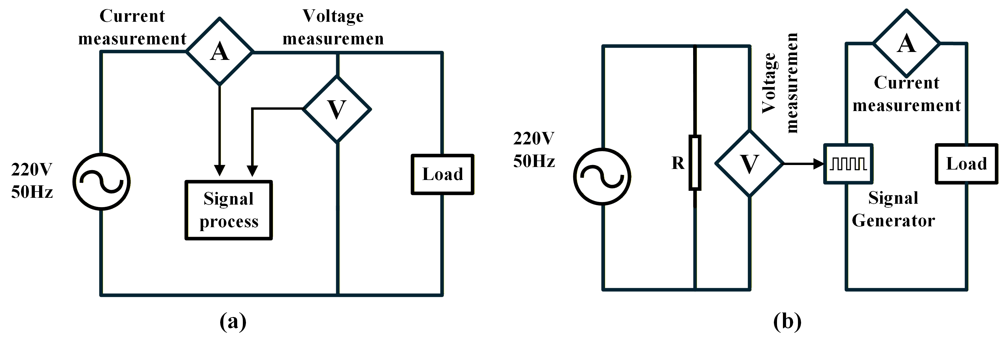
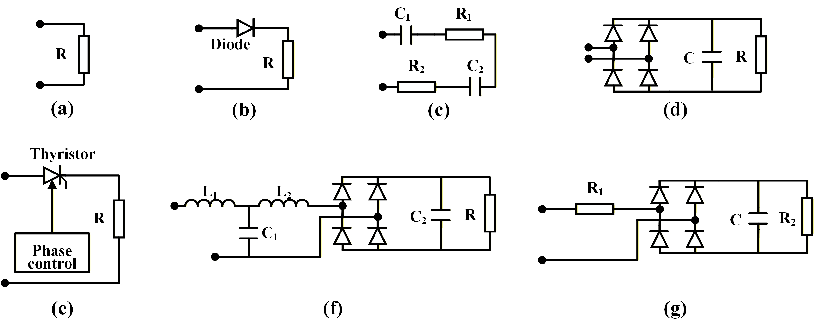

# Data Simulation Parameters

This folder contains the simulation parameters and topology configurations used to generate synthetic load data for validating the analytical federated learning framework.

## 📊 Contents

### Parameter Files
- **`simulation_load_parameters.pdf`** - Comprehensive documentation of all simulation parameters, including electrical characteristics for each appliance type
- **`simulation_load_parameters.xlsx`** - Editable spreadsheet with parameter tables for customization and reference

### Visual Assets
- **`assets/`** - Circuit topology diagrams and simulation configuration illustrations

## 🔌 Simulated Load Topologies

The simulation encompasses multiple appliance categories with distinct electrical characteristics:

Fig.2 Simulation topologies for appliance current waveform modeling. (a) Direct AC-side Sampling Topology; (b) Current-driven Signal Synthesis Topology.

Fig.3 Load Topology. (a) Resistor; (b) Resistive load with diode rectifier; (c) Cascaded RC network, (d) Parallel RC load with diode bridge rectifier, (e) Resistive load with thyristor rectifier; (f) Parallel RC load with diode rectifier and T filter; (g) Parallel RC load with diode rectifier and series resistor.

## Overview of all simulated load types and case distributions

---

**Note**: The simulation parameters are provided as supplementary material to facilitate understanding of the experimental setup during the review process.
