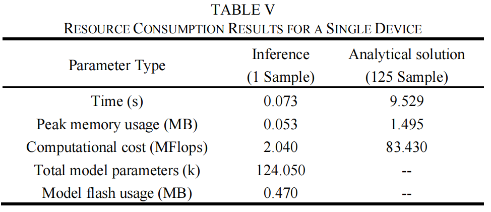
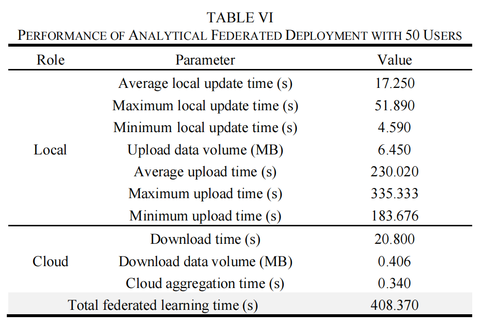

# STM32 Federated Learning Monitoring Platform

## Overview

This monitoring platform implements the hardware deployment experiments described in **Section IV.H (Hardware Deployment Experiment Setup)** of our paper. The platform runs on a PC and provides real-time visualization and coordination of federated learning across multiple STM32-based edge devices through serial communication.

### Demo Video

📹 **[Watch Demo Video](../assets/stm32_deployment_demo.mp4)** (195MB)

The complete deployment demonstration showing hardware setup, dual-device training, and real-time monitoring.

> **Note**: Due to the large file size (195MB), the video is provided as a download link. 

### Key Features

- **Multi-device Coordination**: Supports single-device evaluation and dual-device parallel federated learning
- **Real-time Monitoring**: Visualizes training progress, communication status, and resource consumption
- **Flexible Deployment**: Operates in both simulation mode (no hardware required) and real serial communication mode
- **Bilingual Support**: User interface available in both English and Chinese
- **Comprehensive Logging**: Automatic checkpoint saving and experimental data recording

### System Architecture

The platform emulates large-scale federated learning by sequentially scheduling 50 local users across 2 physical STM32 smart plugs operating in parallel. The system performs cloud-side parameter aggregation and coordinates the complete federated training workflow, including:

1. Sequential data transmission to edge devices
2. Local analytical updates on STM32 devices
3. Parameter upload (classification head and feature gram matrix)
4. Cloud-side aggregation and scheduling

## File Structure

```
stm32_monitoring_platform/
├── stm32_dashboard.py      # Web interface with Streamlit
├── stm32_serial.py          # Serial communication and FL coordination
├── open_platform .bat       # Windows launcher script
└── readme.md                # This file
```

**Key Components:**
- **stm32_dashboard.py**: Web-based monitoring interface (configuration, visualization, bilingual support)
- **stm32_serial.py**: SLIP protocol, parameter exchange, dual-device scheduling, checkpoint management
- **open_platform .bat**: Launcher script (modify Python path for your environment)

## Requirements

### Hardware Requirements
- **Development Setup**: PC with available USB/Serial ports
- **Edge Devices**: STM32-based smart plugs (for real deployment experiments)
  - Single-device mode: 1 device required
  - Dual-device mode: 2 devices required
- **Debugger**: DAP debugger for flashing firmware (not needed for platform operation)

#### Python Environment
- Python 3.7+

#### Required Packages
```bash
pip install streamlit pandas numpy pyserial openpyxl
```

#### Optional Packages
```bash
pip install plotly  # For enhanced interactive visualizations
```

#### Dependency Details
| Package | Version | Purpose |
|---------|---------|---------|
| streamlit | ≥1.0.0 | Web-based user interface |
| pandas | ≥1.0.0 | Data loading and processing |
| numpy | ≥1.18.0 | Numerical computations |
| pyserial | ≥3.4 | Serial communication |
| openpyxl | ≥3.0.0 | Excel file I/O |
| plotly | ≥4.0.0 | Interactive charts (optional) |

## Installation

### Step 1: Clone Repository
```bash
git clone https://github.com/2771618309/An-Analytical-Federated-Learning-Method-for-Scalable-NILM.git
cd An-Analytical-Federated-Learning-Method-for-Scalable-NILM/stm32_deployment/stm32_monitoring_platform
```

### Step 2: Install Dependencies
```bash
pip install -r requirements.txt
# Or: pip install streamlit pandas numpy pyserial openpyxl plotly
```

### Step 3: Prepare Data (Optional for Simulation)
For real experiments, prepare client data files in Excel format:
```
data/
├── client_0_data.xlsx
├── client_1_data.xlsx
├── ...
└── client_N_data.xlsx
```

#### Data Format Specification

Each Excel file should contain the local training data for one client with the following structure:

**Column Layout:**
- **Columns 0-149** (150 columns): Current signal samples (high-frequency current waveform)
- **Columns 150-299** (150 columns): Voltage signal samples (high-frequency voltage waveform)
- **Column 300** (last column): Label (appliance class identifier)

**Example Structure:**

| I_0 | I_1 | ... | I_149 | V_0 | V_1 | ... | V_149 | Label |
|-----|-----|-----|-------|-----|-----|-----|-------|-------|
| 0.12 | 0.15 | ... | 0.10 | 220.1 | 220.3 | ... | 220.0 | 3 |
| 0.08 | 0.11 | ... | 0.09 | 220.2 | 220.1 | ... | 220.4 | 1 |
| ... | ... | ... | ... | ... | ... | ... | ... | ... |

**Data Requirements:**
- **Total Columns**: 301 (150 current + 150 voltage + 1 label)
- **Rows**: Variable (number of samples for this client, e.g., 125-225 samples)
- **Current/Voltage Values**: Floating-point numbers (normalized or raw ADC values)
- **Label Values**: Integer class identifiers (0, 1, 2, ..., N-1 for N appliance classes)
- **File Format**: `.xlsx` (Excel 2007+ format)
- **Naming Convention**: `client_<ID>_data.xlsx` where ID is 0-indexed

**Note:** For simulation mode, data preparation is optional. The platform can generate synthetic data automatically.

## Usage

### Quick Start

#### Quick Start on Windows
1. Double-click `open_platform.bat` to launch the platform
2. The platform will automatically open in your default web browser at `http://localhost:8501`

**Note:** If the batch file doesn't work, edit `open_platform.bat` and update the Python executable path to match your installation, then try again.

### Running Experiments

#### 1. Simulation Mode (No Hardware Required)
This mode is ideal for testing the platform without physical devices.

**Steps:**
1. In the sidebar, select **Run Mode** → **Run Type** → **Simulation Test (🧪)**
2. Configure simulation parameters:
   - **Simulated Client Count**: Number of virtual clients (e.g., 50)
   - **Device Mode**: Single or dual device
3. Click **Start** to begin simulation
4. Monitor real-time progress in the dashboard

**Output:** Simulated training statistics and timing analysis.

#### 2. Real Serial Communication Mode

**Single-Device Mode:**
1. Connect 1 STM32 device via USB
2. Select **Device Mode** → **Single Device**
3. Load client data (Data Loading section)
4. Configure serial port (Refresh → Select → Test Connection)
5. Click **Start Training**

**Dual-Device Mode:**
1. Connect 2 STM32 devices
2. Select **Device Mode** → **Dual Device Parallel**
3. Load data and configure both serial ports
4. Start training

The platform automatically schedules clients, displays real-time status (Waiting → Training → Uploading → Completed), and saves checkpoints.

### Configuration Options

- **Language**: Chinese/English
- **Baudrate**: 460800 (default)
- **Scale Factor**: 100.0 (default)
- **Auto-refresh**: 2s interval
- **Checkpoints**: Auto-saved per client

## Platform Interface


*Screenshot: Main dashboard showing dual-device federated training*

**Key Components:**
- **Status Header**: Overall progress, system status, average metrics
- **Client Progress Table**: Individual status, timing, error tracking
- **Device Statistics**: Per-device metrics (dual-device mode)
- **Visualization Charts**: Progress, computation time, communication overhead

> Note: Add your platform screenshots to `../assets/` folder and they will be displayed here.

## Experimental Results

This platform was used to validate the results reported in **Table V** and **Table VI** of our paper:


*Table V: Single-device resource consumption*


*Table VI: Multi-device federated learning performance*

> Note: Add your experimental result figures to `../assets/` folder.

### Single-Device Resource Consumption (Table V)
- **Forward Inference (1 sample)**: 0.073 s (73 ms), 0.053 MB memory
- **Local Analytical Update (125 samples)**: 9.529 s, 1.495 MB peak memory
- **Model Flash Storage**: 0.470 MB (124,050 parameters)

### Multi-Device Federated Learning (Table VI)
Using 2 smart plugs coordinating 50 users:
- **Local Update Time**: 17.250 s (avg), 51.890 s (max)
- **Parameter Upload Time**: 230.020 s (avg), 335.333 s (max)
- **Upload Data Volume**: 6.450 MB per device
- **Cloud Aggregation Time**: 0.340 s (minimal overhead)
- **Total Training Time**: 408.370 s for 50 users

These results demonstrate low resource consumption and suitability for large-scale edge deployment.

## Troubleshooting

**Serial Port Issues:**
- Install CH340/CP2102 drivers
- Check Device Manager (Windows) or `ls /dev/tty*` (Linux/Mac)
- Verify baudrate matches firmware

**Timeout/Training Issues:**
- Increase timeout in `stm32_serial.py` (default: 600s)
- Reset STM32 device
- Verify data format (301 columns)

**Platform Not Starting:**
- Check dependencies: `pip list`
- Verify Python ≥3.7
- Debug mode: `streamlit run stm32_dashboard.py --logger.level=debug`

## Code Release Notice

**Current Release:** Monitoring platform (frontend and coordination logic)

**Firmware Release:** STM32 firmware will be released after paper acceptance (contains core algorithm)

## Citation

If you use this platform in your research, please cite:

```bibtex
@article{guo2026analytical,
  title={An Analytical Federated Learning Framework for Scalable Non-Intrusive Load Monitoring},
  author={Wenlong Guo, Qingquan Luo, Tao Yu, Xiaolei Hu, Yufeng Wu, and Zhenning Pan},
  journal={TODO: Update journal name after acceptance},
  year={2026}
}
```

**Note:** Replace `journal` field with actual journal name after paper acceptance (e.g., "IEEE Transactions on Smart Grid").

## Contact

- **GitHub**: https://github.com/2771618309/An-Analytical-Federated-Learning-Method-for-Scalable-NILM
- **Issues**: https://github.com/2771618309/An-Analytical-Federated-Learning-Method-for-Scalable-NILM/issues
- **Email**: 2771618309@qq.com

## License

See [LICENSE](../../LICENSE) in the repository root.

---

**Demo Video:** See video at the top of this README or download from [assets folder](../assets/stm32_deployment_demo.mp4).
